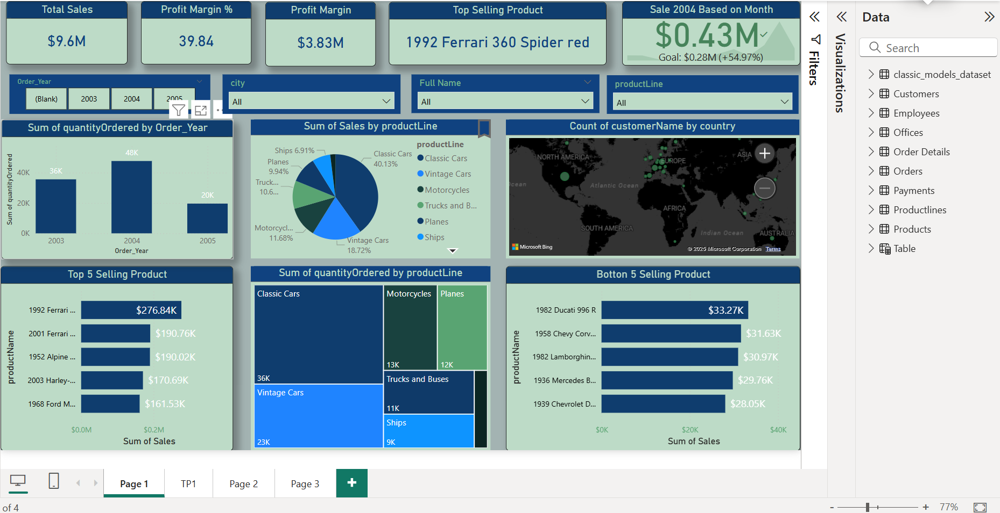
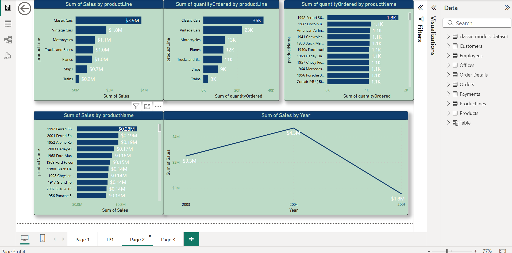
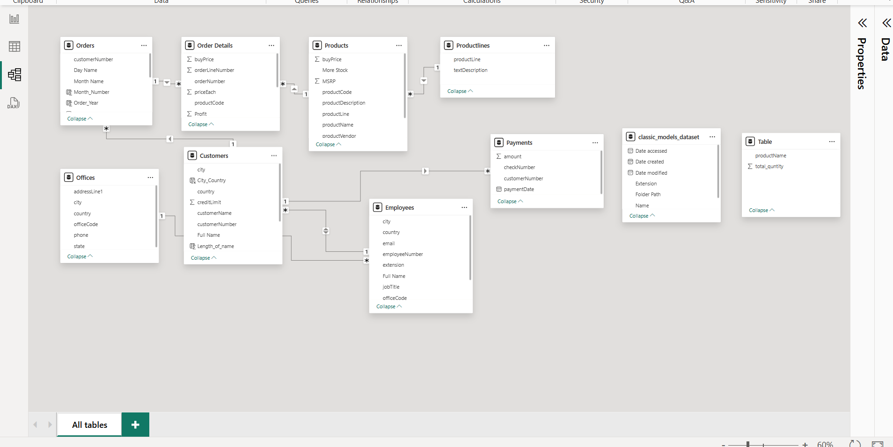

# 🧠 Sales Dashboard - Power BI Project

## 📌 Overview

This project is a **Sales Dashboard** built using **Power BI** to visualize and analyze key sales data for better business decision-making. It demonstrates my ability to clean data, create relationships, and build interactive visuals for actionable insights.

---

## 🎯 Objectives

- Track sales performance across different regions and product categories
- Identify top-performing and underperforming segments
- Enable decision-makers to filter and explore key metrics interactively
- Present clear visual stories from complex data

---

## 📊 Key Features

- **Interactive filters** for year, region, category, and product
- **KPIs**: Total Sales, Total Profit, Average Profit Margin, Total Orders
- **Visualizations**:
  - Bar charts for comparing regional sales
  - Line graphs for sales trends over time
  - Pie charts to show product category contribution
  - Map view for geographic sales distribution
  - Table for transactional data with filters

---

## 🛠️ Tools Used

- **Power BI Desktop** for dashboard creation
- **Microsoft Excel** for data cleaning and formatting
- **DAX (Data Analysis Expressions)** for calculated columns and measures

---

## 🖼️ Screenshots

